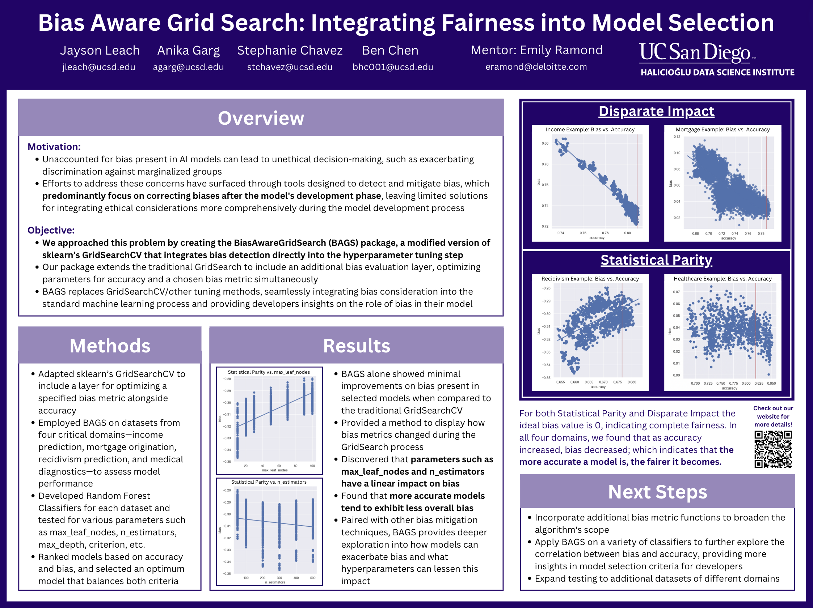

This page is still under construction. More unpublished/ongoing content will be added soon!

## AI/ML

<table style="width:100%;border:0px;border-spacing:0px;border-collapse:separate;margin-right:auto;margin-left:auto;">
  <tr>
    <td style="padding:2.5%;width:25%;vertical-align:middle;min-width:120px">
      
    </td>
    <td style="padding:2.5%;width:75%;vertical-align:middle">
      <h3>BAGS: Bias Aware Gridsearch</h3>
      <b>Benjamin Chen</b>, Jayson Leach, Stephanie Chavez
       
      <a href="https://474benchen.github.io/bias_aware_gridsearchCV/">website</a> / <a href="https://drive.google.com/file/d/1NSoYsN-Rs61RwzscNFZVFwr9nF6jOkkI/view?usp=sharing">poster</a> / <a href="https://github.com/474benchen/bias_aware_gridsearchCV">code</a>
      
We introduce a novel implementation of GridsearchCV uniquely designed to optimize machine learning models not only for accuracy but also for fairness metrics. This project addresses the critical need for unbiased models in machine learning, especially in sensitive domains like healthcare, recidivism prediction, mortgage lending, and income-based financial decisions.

    </td>
  </tr>
</table>

## Geospatial

## Data Analysis